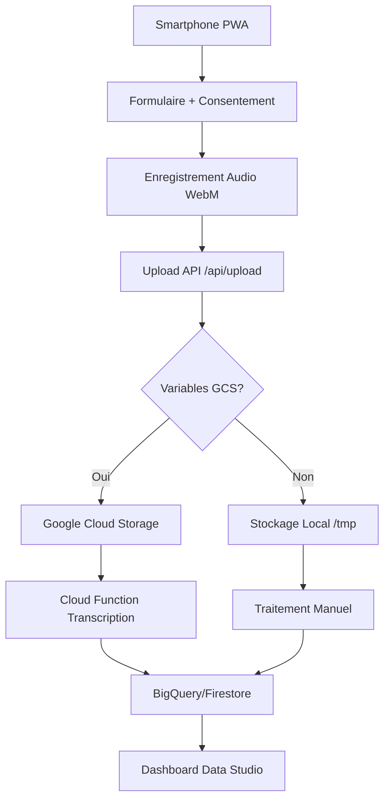
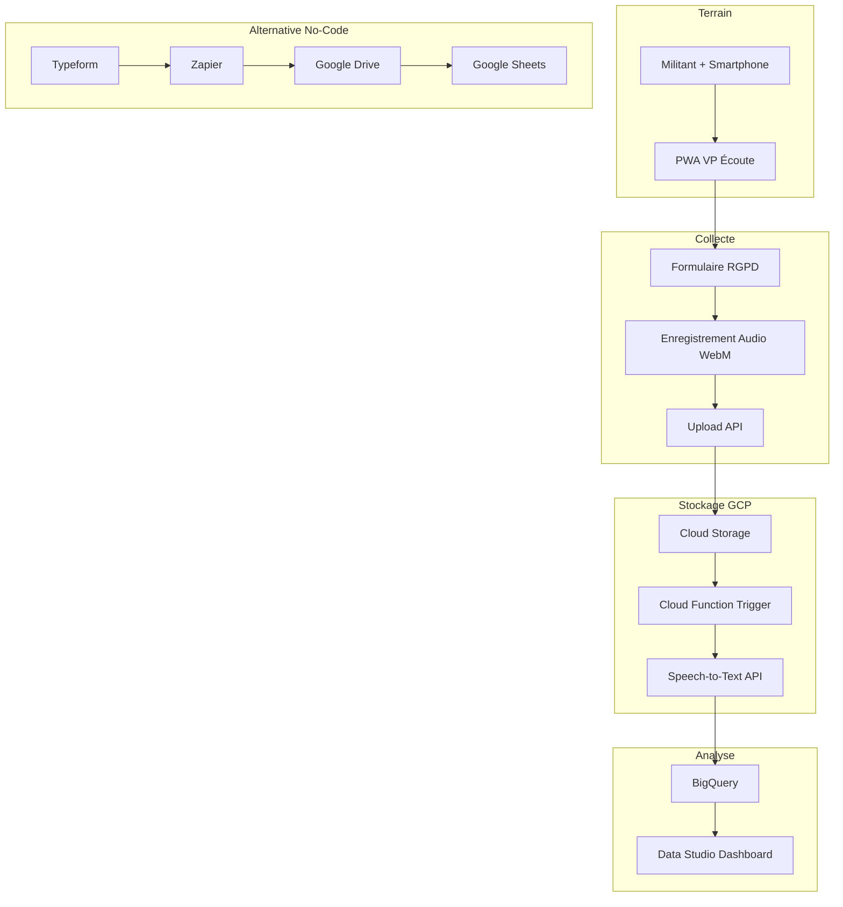

# Solution Complète - Campagne d'Écoute Citoyenne VP

## A) Résumé Exécutif

Solution PWA mobile-first permettant la collecte d'entretiens audio (~20min) avec données personnelles et consentement RGPD. Upload intelligent vers Google Cloud Storage ou stockage local, transcription via Speech-to-Text GCP, restitution BigQuery/Sheets. Déploiement Vercel en 1-clic, coût estimé 50-500€/mois selon volume.

## B) Workflow Opérationnel

### 1. Collecte Terrain
- **Action** : Militant ouvre PWA sur smartphone, renseigne participant (nom/prénom/commune/email/tel) + consentement
- **Outil recommandé** : PWA Next.js (cette solution) 
- **Alternative no-code** : Typeform avec champs personnalisés + redirection vers enregistreur

### 2. Enregistrement Audio  
- **Action** : Tap "Démarrer", entretien ~20min, tap "Arrêter", tap "Envoyer"
- **Outil recommandé** : MediaRecorder API (WebM 16kHz mono)
- **Alternative no-code** : App mobile Rev.com/Otter.ai + partage auto Google Drive

### 3. Stockage Centralisé
- **Action** : Upload automatique avec métadonnées structurées
- **Outil recommandé** : Google Cloud Storage via API
- **Alternative no-code** : Google Drive via Zapier/Make + auto-organisation

### 4. Transcription Batch
- **Action** : Job automatique chaque soir sur nouveaux fichiers
- **Outil recommandé** : Google Speech-to-Text API
- **Alternative no-code** : Zapier + Speech-to-Text + Google Sheets

### 5. Restitution
- **Action** : Consultation dashboard avec filtres (commune, période, mots-clés)
- **Outil recommandé** : BigQuery + Data Studio ou Sheets
- **Alternative no-code** : Google Sheets avec tableaux croisés dynamiques

## C) Solution CODE (Next.js PWA)

### Architecture Technique



### Commandes de Déploiement

```bash
# 1. Installation
npm install

# 2. Développement
npm run dev

# 3. Build production  
npm run build

# 4. Déploiement Vercel
npx vercel --prod
```

### Variables d'Environnement Vercel

Dans l'interface Vercel → Settings → Environment Variables :

| Nom | Valeur | Description |
|-----|--------|-------------|
| `SERVICE_ACCOUNT_KEY_BASE64` | `ewogICJ0eXBlIjogInNlcnZpY2V...` | Clé service account GCP en base64 |
| `GCS_BUCKET` | `vp-ecoute-entretiens` | Nom du bucket Cloud Storage |

**Obtenir la clé base64 :**
```bash
cat service-account-key.json | base64 -w 0
```

### Points Clés du Code

#### API Route Upload (`app/api/upload/route.ts`)
- Accepte multipart : audio WebM + métadonnées JSON
- Fallback automatique : GCS → stockage local si variables manquantes
- Validation champs requis + format email/téléphone

#### Composant AudioRecorder (`app/components/AudioRecorder.tsx`)  
- MediaRecorder API WebM 16kHz mono (optimal Speech-to-Text)
- Gestion permissions microphone
- Compteur temps réel + limite 20min

#### PWA Configuration
- Manifeste : installation écran d'accueil
- Service Worker : cache offline
- Viewport mobile optimisé

### Test de l'Application

```bash
# Démarrage local
npm run dev

# Test PWA mobile
# → Ouvrir Chrome DevTools → Device Mode → iPhone
# → http://localhost:3000
# → Tester : Formulaire → Enregistrement → Upload
```

## D) Solution NO-CODE/Low-Code

### Option 1 : Typeform + Google Drive + Zapier

#### Configuration Typeform
```
Champs formulaire :
- Prénom (court_text, requis)
- Nom (court_text, requis)  
- Commune (court_text, requis)
- Email (email, requis)
- Téléphone (phone_number, requis)
- Consentement (yes_no, requis) : "J'accepte que mes données..."
- Upload Audio (file_upload, formats: mp3,wav,m4a, max 50MB)
```

#### Automation Zapier
```
Trigger: Typeform "New Response"
Action 1: Google Drive "Upload File" 
  └── Dossier: /VP-Ecoute/{{date}}/
  └── Nom: {{prénom}}-{{nom}}-{{timestamp}}.{{extension}}
Action 2: Google Sheets "Create Row"
  └── Feuille: Entretiens_Metadata  
  └── Colonnes: Date, Prénom, Nom, Commune, Email, Téléphone, Fichier_URL
Action 3: Google Speech-to-Text "Transcribe Audio" (si disponible)
Action 4: Google Sheets "Update Row" avec transcription
```

#### Avantages/Inconvénients
| ✅ Avantages | ❌ Inconvénients |
|---------------|------------------|
| Zéro code | Limite 50MB/fichier |
| Interface connue | Pas d'enregistrement direct |
| RGPD compliant | Coût Zapier |
| Automation simple | Pas offline |

#### Quotas et Coûts
- **Typeform Pro** : 39€/mois (1000 réponses/mois, upload files)
- **Zapier Professional** : 59€/mois (1000 tâches/mois)  
- **Google Drive** : 6€/mois (100GB)
- **Total** : ~100€/mois

### Option 2 : Qomon + Make + Google Workspace

#### Configuration Qomon
- Formulaire terrain avec champs VP
- Export CSV automatique
- App mobile pour enregistrement

#### Scénario Make  
```
Webhook Qomon → Parse CSV → Google Drive Upload → Speech-to-Text → BigQuery Insert
```

## E) Transcription Google Cloud Platform

### Configuration Speech-to-Text

#### Variables d'Environnement Nécessaires
```env
# Authentification
GOOGLE_APPLICATION_CREDENTIALS=./service-account-key.json
# ou
SERVICE_ACCOUNT_KEY_BASE64=<clé_base64>

# Configuration
GCP_PROJECT_ID=mon-projet-vp
GCS_BUCKET=vp-ecoute-entretiens  
SPEECH_TO_TEXT_LANGUAGE=fr-FR
```

#### Script de Transcription Batch
```javascript
// Cloud Function ou cron job
async function transcribeNewFiles() {
  const storage = new Storage();
  const speech = new SpeechClient();
  
  // Lister nouveaux fichiers
  const [files] = await storage.bucket(GCS_BUCKET).getFiles({
    prefix: 'entretiens/',
    delimiter: '/'
  });
  
  for (const file of files) {
    if (!file.metadata.transcribed) {
      const request = {
        audio: { uri: `gs://${GCS_BUCKET}/${file.name}` },
        config: {
          encoding: 'WEBM_OPUS',
          sampleRateHertz: 16000,
          languageCode: 'fr-FR',
          enableAutomaticPunctuation: true,
          model: 'latest_long'
        }
      };
      
      const [operation] = await speech.longRunningRecognize(request);
      const [response] = await operation.promise();
      
      // Stocker transcription dans BigQuery/Firestore
      await saveTranscription(file.name, response.results);
    }
  }
}
```

#### Stockage des Transcriptions
- **BigQuery** : Table `vp_entretiens` (id, participant, commune, transcription, sentiment, mots_clés)
- **Alternative Firestore** : Collection `entretiens` avec recherche full-text
- **Fallback Sheets** : Colonne transcription dans Google Sheets existant

## F) Livrables

### Architecture Mermaid



### Checklist RGPD/Consentement

#### Texte de Consentement (à afficher avant enregistrement)
> **Consentement RGPD :** J'accepte que mes données personnelles et mon enregistrement audio soient collectés et traités par les Victoires Populaires dans le cadre de cette campagne d'écoute citoyenne. Ces données seront conservées 2 ans maximum et peuvent être supprimées sur demande.

#### Stockage du Consentement  
```json
{
  "consent": true,
  "consentTimestamp": "2024-01-15T14:30:00Z",
  "consentVersion": "v1.0",
  "participantId": "uuid-unique",
  "ipAddress": "192.168.1.1" // optionnel
}
```

#### Durée de Conservation
- **Données audio** : 24 mois maximum
- **Données personnelles** : 24 mois maximum  
- **Transcriptions anonymisées** : 5 ans (recherche)

#### Processus de Suppression
1. **Sur demande** : Email à dpo@victoires-populaires.fr avec nom/prénom/commune
2. **Automatique** : Script mensuel supprime données > 24 mois
3. **Anonymisation** : Remplacement nom/email par hash après 6 mois

### Budget Indicatif

#### Hypothèses de Calcul
- **Durée moyenne** : 20 minutes par entretien
- **Qualité audio** : 16kHz mono WebM ≈ 1MB/minute  
- **Taille fichier** : `20 min × 1MB/min = 20MB par entretien`
- **Formule** : `Taille(MB) = durée_minutes × 1MB/min`

#### Scénario 1 : Pilote (100 entretiens/mois)
| Service | Calcul | Coût |
|---------|--------|------|
| Vercel Pro | Apps + bandwidth | 20€/mois |
| Cloud Storage | 100 × 20MB = 2GB | 0.05€/mois |
| Speech-to-Text | 100 × 20min = 33h audio | 50€/mois |
| BigQuery | 100 rows/mois | 0€ (gratuit) |
| **Total** | | **70€/mois** |

#### Scénario 2 : Déploiement (1000 entretiens/mois)  
| Service | Calcul | Coût |
|---------|--------|------|
| Vercel Pro | Scaling | 20€/mois |
| Cloud Storage | 1000 × 20MB = 20GB | 0.50€/mois |
| Speech-to-Text | 1000 × 20min = 333h audio | 500€/mois |
| BigQuery | 1k rows + queries | 5€/mois |
| **Total** | | **525€/mois** |

#### Scénario 3 : National (10k entretiens/mois)
| Service | Calcul | Coût |
|---------|--------|------|
| Vercel Enterprise | High traffic | 100€/mois |
| Cloud Storage | 10k × 20MB = 200GB | 5€/mois |  
| Speech-to-Text | 10k × 20min = 3333h audio | 5000€/mois |
| BigQuery | 10k rows + analytics | 50€/mois |
| **Total** | | **5155€/mois** |

*Prix indicatifs - vérifier tarifs actuels sur cloud.google.com*

#### Option Ultra-Économique
**PWA → Google Drive public + traitement manuel**
- Coût : 0€ (quotas gratuits)
- Limite : 100 fichiers/jour, transcription manuelle
- Workflow : Upload PWA → Drive → Download batch → Transcription locale

### Points d'Attention/Risques/Limitations

#### Techniques
- **Compatibilité navigateur** : WebM non supporté sur Safari ancien (fallback MP4)
- **Limite upload Vercel** : 50MB par fichier (entretiens >50min problématiques)
- **Offline** : Service Worker cache basique, pas de sync background
- **iOS Safari** : Limitations PWA (pas d'installation auto)

#### Opérationnels  
- **Formation militants** : 30min formation smartphone requis
- **Réseau terrain** : 4G/WiFi nécessaire pour upload (pas de mode offline complet)
- **Transcription délai** : Speech-to-Text prend 10-30min par fichier
- **Qualité audio** : Environnement bruyant dégrade transcription

#### Légaux/RGPD
- **Consentement mineur** : Signature tuteur légal requise <16 ans
- **Transfert international** : Google Cloud EU uniquement (configurer région)
- **Sous-traitance** : DPA avec Google Cloud nécessaire
- **Audit** : Log des accès aux données requis

#### Coûts Cachés
- **Formation équipe** : 2-3 jours développeur pour maintenance
- **Support** : Help-desk pour militants (bugs, formation)
- **Évolutions** : Nouvelles fonctionnalités ~1 jour/dev/mois

#### Alternatives de Secours
1. **Si budget Speech-to-Text trop élevé** : Transcription humaine Rev.com (1€/min)
2. **Si GCP indisponible** : AWS Transcribe ou Azure Speech
3. **Si PWA problématique** : App mobile React Native ou Flutter

---

**Contact technique** : dev@victoires-populaires.fr  
**Version** : 1.0 - Janvier 2024
